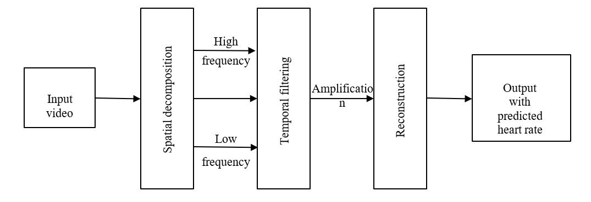
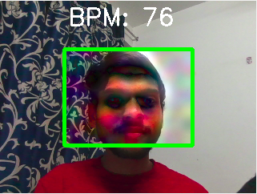
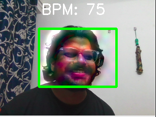
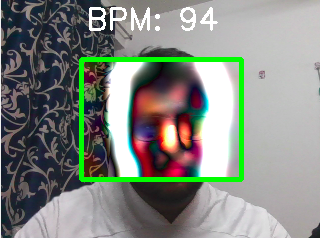

# BM5013 Course Project

# Course Details

**Course Code**: BM5013

**Course Name**: Sensor and Transducers

**University**: Indian Institute of Technology, Hyderabad (IITH)

**Semester and Year**: Fifth Semester, Aug-Nov 2022.

**Instructor**: Dr. Nagarajan Ganapathy 
## Team Details
**Team Members**: Ameya Chatur, Samar Singhai, Syed Saqib Habeeb, Vidya Ajay
###### All the members have equally contributed towards achieving the goal of the project. 

## Project Details
>This project is an experimental study on real-time heart-rate monitoring using a camera's remote photoplethysmography(rPPG). 

In this project we tried to find the real-time heart rate of people through the camera. There are many algorithms existing for rPPG based on data-driven or meta learning approaches. But they require high computing power. So to solve this problem we extended the *Eulerial Video Magnification Algorithm* to find the heart rate. It's much more efficient. Here is our algorithm skeleton.

*The flow chart above shows the schematic representation of the heart rate predicting algorithm*
#### Here are the output of our algorithm for the three subject

